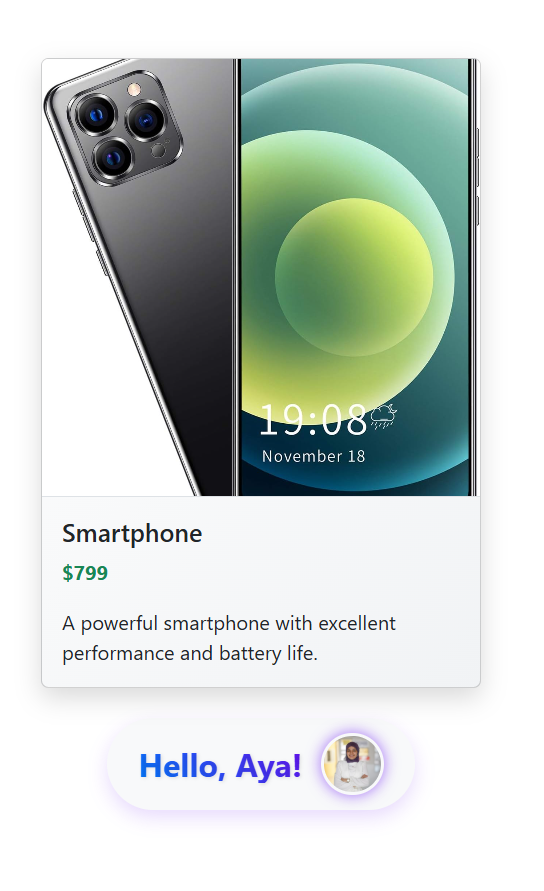
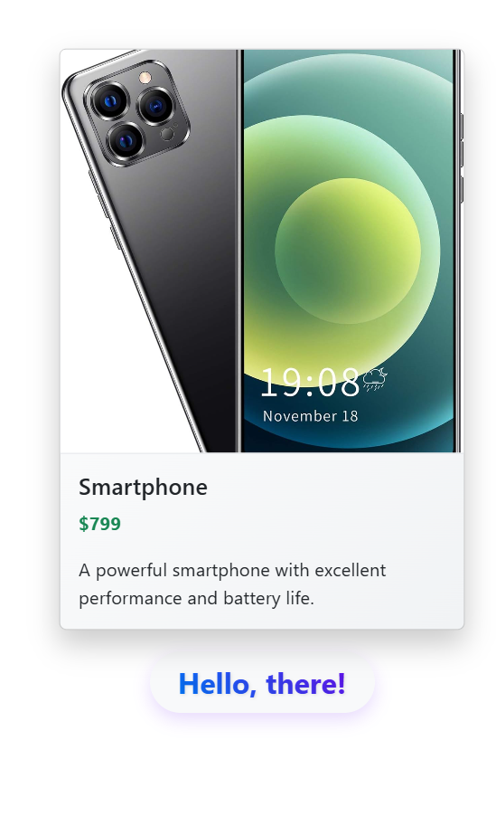

# React Checkpoint – Product Card App

This project is a small React application built during a checkpoint exercise.  
It demonstrates working with React components, JSX, conditional rendering, and styling using React-Bootstrap and CSS.

---

## 🚀 Features

- Displays a product card using reusable React components.
- Shows product name, price, description, and image from a JSON object.
- Displays a greeting message below the card:
  - If a name is provided, it says: `"Hello, Aya!"` with a profile picture.
  - If no name is provided, it says: `"Hello, there!"` with **no** image.
- Fully styled with custom CSS and Bootstrap for modern look and interactivity.


---

## 📷 Screenshots

### ✅ With Name (`const firstName = "Aya"`)


### ❌ Without Name (`const firstName = ""`)


> 🔎 Note: The profile picture is only displayed when the name is provided.

---

## 🛠️ Technologies Used

- React
- JSX
- React-Bootstrap
- CSS3
- Conditional rendering

---

## 🧠 How to Use

1. Clone the repository:
   ```bash
   git clone https://github.com/your-username/checkpoint-react.git
   cd checkpoint-react
